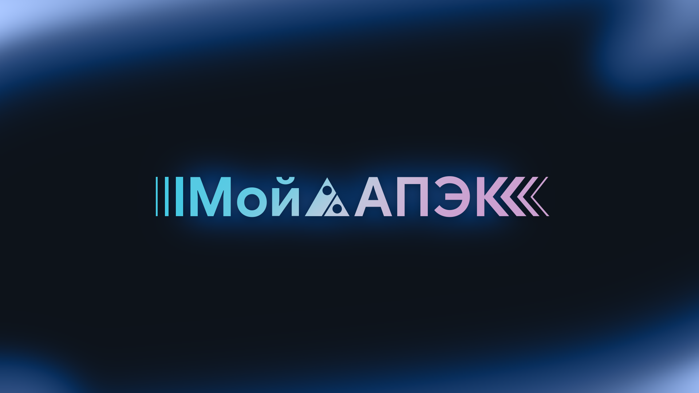
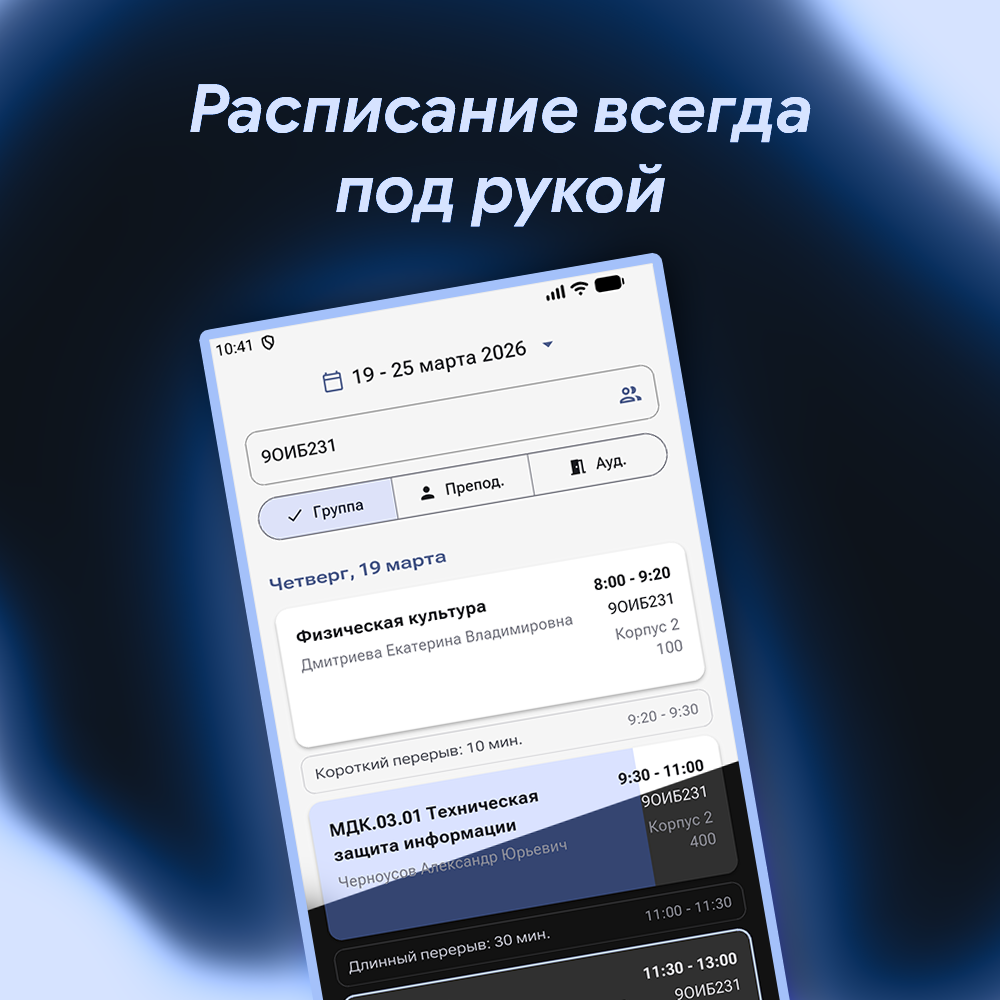
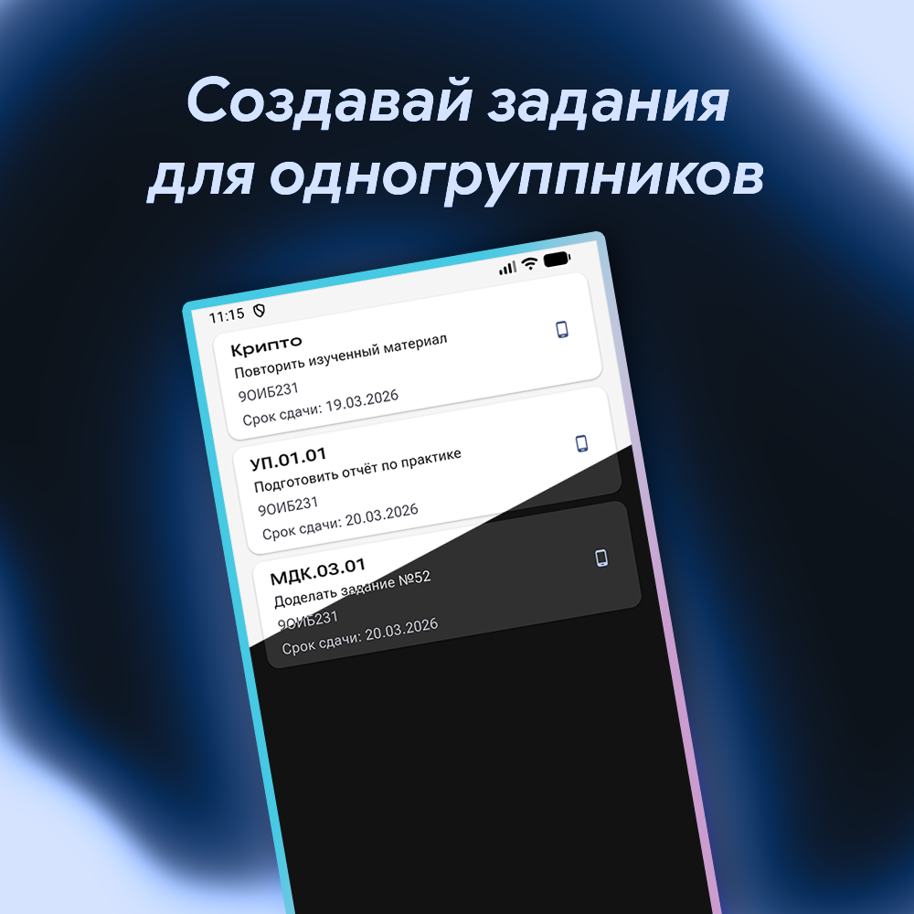
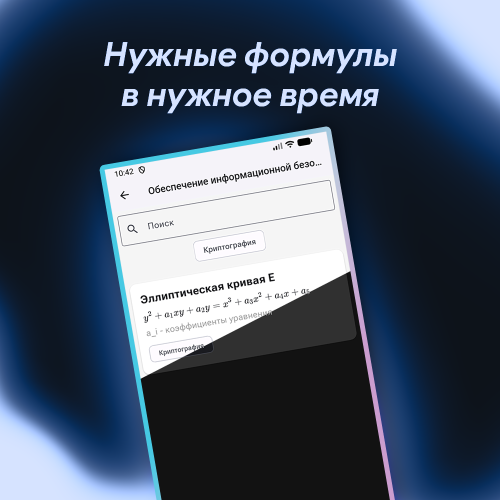
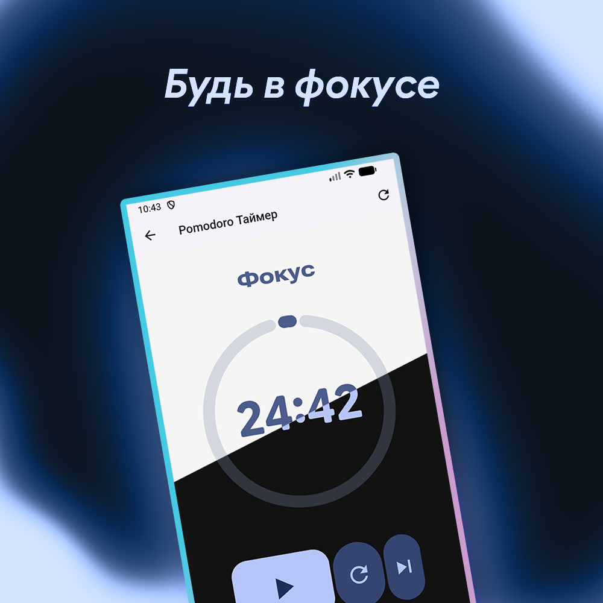

   
 

# МойАПЭК (MyASIEC)

Неофициальное приложение для студентов **КГБПОУ "Алтайский промышленно-экономический колледж"**. Написанное на Flutter, это приложение предоставляет удобный доступ к расписанию, домашним заданиям и другим полезным инструментам для учебы.

## 🚀 Основные возможности

*   **Просмотр расписания**: Всегда актуальное расписание занятий для вашей группы, преподавателя или конкретной аудитории.
*   **Задания**:
    *   Добавляйте и редактируйте задания.
    *   Прикрепляйте фотографии к заданиям.
    *   Возможность сохранения заданий как локально (офлайн), так и на сервере.
*   **Таймер Pomodoro**:
    *   Встроенный таймер для эффективной работы и учебы по методике Pomodoro.
*   **Персонализация**:
    *   Material Design 3 (Material You) придаёт приложению современный вид с возможностью адаптации под вашу тему.

## 📸 Скриншоты

## 🛠️ Технологии

*   **Flutter + Dart**: Кроссплатформенный фреймворк для создания нативных приложений.
*   **Supabase**: Backend-платформа для работы с базой данных, аутентификации и хранения файлов.
*   **Hive**: Легковесная и быстрая база данных NoSQL для локального хранения данных.

## 🔧 Сборка

1.  Убедитесь, что у вас установлен [Flutter SDK](https://flutter.dev/docs/get-started/install) и [Android Studio](https://developer.android.com/studio).
2.  Перейдите в папку, где будет сохранен репозиторий и клонируйте его командой `git clone https://github.com/Ono-va-ne/my_asiec`
3.  Перейдите в директорию проекта: `cd my_asiec`
4.  Установите зависимости: `flutter pub get`
5.  Для работы с Supabase вам потребуется создать файл `lib/supabase_options.dart` с `url` и `anon_key`.
6. Подготовьте устройство для отладки (физическое или виртуальное)
7.  Запустите приложение: `flutter run`

## 📄 Лицензия

Этот проект распространяется под лицензией MIT. Смотрите файл `LICENSE` для получения дополнительной информации.